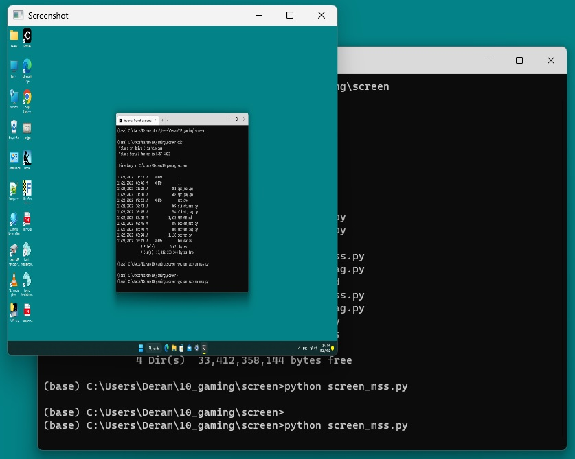

This is project to demo how to use these two Python libraries MSS [Ref 1] and PYAUTOGUI [Ref 2] in   
1. Standalone Applications (UC1): Take a screen shot, resize and display it  
- screen_mss.py (hit any key to terminate)  
- screen_pag.py (hit any key to terminate)  
2. Client-server Applications (UC2): Take screenshots, transfer them from client 
to server and display by the server  
- server.py  
- client_mss.py (esc to terminate)  
- client_pag.py (esc to terminate)  
3. Web Applications (UC3): Take screenshots by webservers, and delivery to 
a web browser on demand.
- app_mss.py  
- app_pag.py  
- http://host:port/ (url @ web browser)

This project also uses the concepts and skills of another [Ref 3]  
"Live Video Streaming with Python", and proves that 
- live video and  
- screenshots  
are only different types of contents which are independent. Same technologies  
can be used to process them.  
 
Please refer that project about the details for
1. Client-Server programming with socket
2. Data Transfer with Protocol (simple header-body structure)
3. Multi-thread (server side connection handling)
4. Live Video with OpenCV (video capture and show at different sides)
5. Asynchronous Programming (client side key-event handling)
6. Web version with Flask (minimum code and html)

  
  
  

[Ref 1] https://python-mss.readthedocs.io/  
[Ref 2] https://pyautogui.readthedocs.io/en/latest/  
[Ref 3] https://github.com/yi-miao/Live-Video-Streaming-with-Python  
